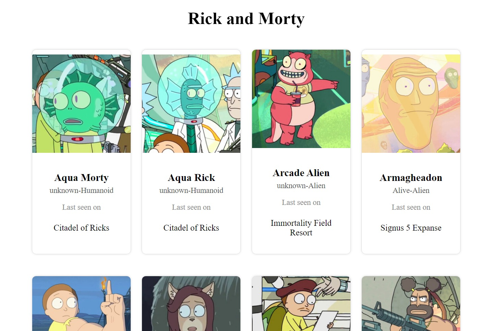
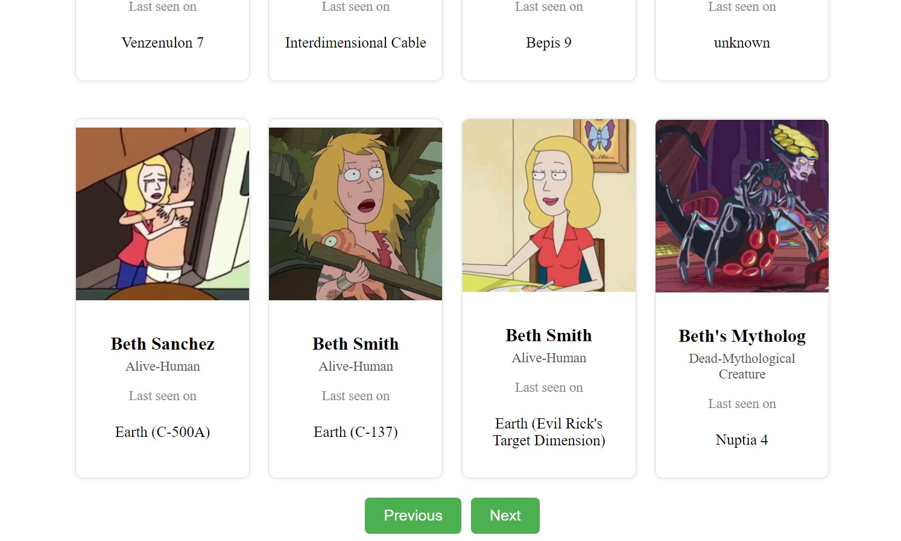

# React Query Rick and Morty App

Welcome to the React Query Rick and Morty app! This app utilizes React Query to fetch and display characters from the Rick and Morty API.

## Project Structure

-   **App.js**: The main component that sets up the application structure and includes the `Characters` component.
-   **components/**
    -   **Characters.js**: Component responsible for fetching and displaying characters using React Query.
    -   **Character.js**: Component to render individual character details.

## Getting Started

1. Clone the repository:

    ```bash
    git clone https://github.com/harshm413/react-query-rick-and-morty.git
    ```

2. Navigate to the project directory:

    ```bash
    cd react-query-rick-and-morty
    ```

3. Install dependencies:

    ```bash
    npm install
    ```

4. Run the project:

    ```bash
    npm start
    ```

5. Open your browser and visit [http://localhost:3000](http://localhost:3000) to see the Rick and Morty app in action.

## Features

-   **Characters Listing**: Displays characters from the Rick and Morty API.
-   **Pagination**: Allows navigating through different pages of character data.
-   **React Query Integration**: Utilizes React Query for efficient data fetching and caching.

## Technologies Used

-   React
-   React Query
-   Axios
-   CSS

## Project Preview




## Contributing

Feel free to contribute to the project by submitting issues or pull requests. Your feedback is highly appreciated!

## License

This project is open-source and available under the [MIT License](LICENSE).

Happy exploring the multiverse with Rick and Morty! 🚀🌌
